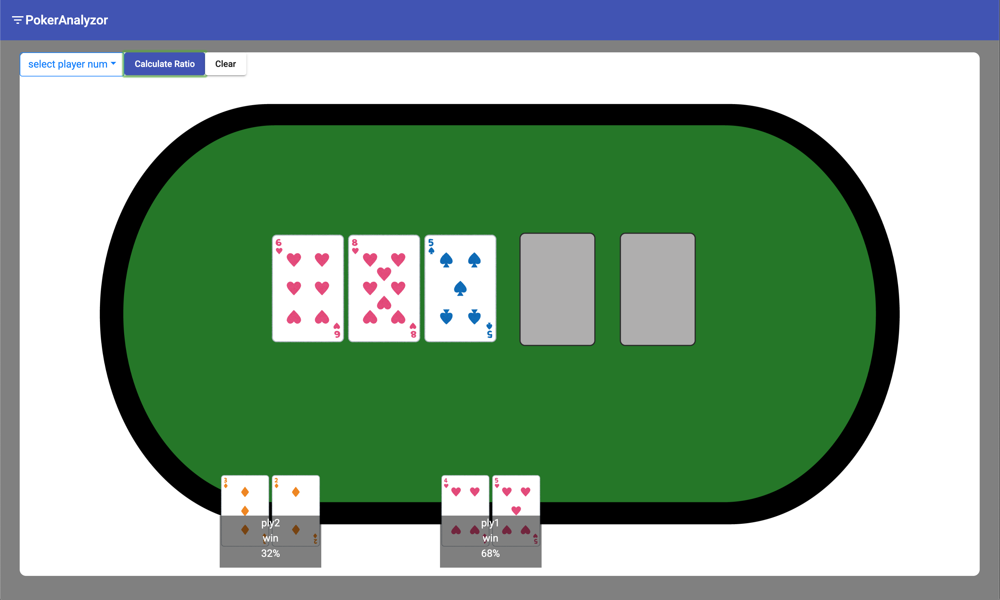

# PokerAnalyzor
これはポーカーのテキサスホールデムにおける勝率計算のWEBアプリです．
本アプリを使用するにあたりフロントとバックで開発サーバを立てる必要があります．
以下それぞれの起動方法です

## PokerAnalyzor(FLONT)
Angular-cli ver.8.0.6

### Development server
`npm install`を実行して起動に必要なモジュールのインストールをしてください．
`ng serve`を実行してください．

### How To Use
ply1から順番にプレイヤーに配られたスターティングハンドを入力し，左上のCalculateボタンを押します．

それぞれのプレイヤーに配られたハンドとボードのカードを外したい時はclearボタンを押してください

## PokerAnalyzor(BACK)
Python ver.3.6.5

### Development server
serverディレクトリ内のrequirement.txt を `pip install -r requirement.txt`でインストール
`python app.py`を実行してください

## それぞれのディレクトリの説明
- server以下
    - PythonのAPIサーバ関連のコードが記述されています
- src以下
    - Angularで記述されたView関連のコードが格納されています

